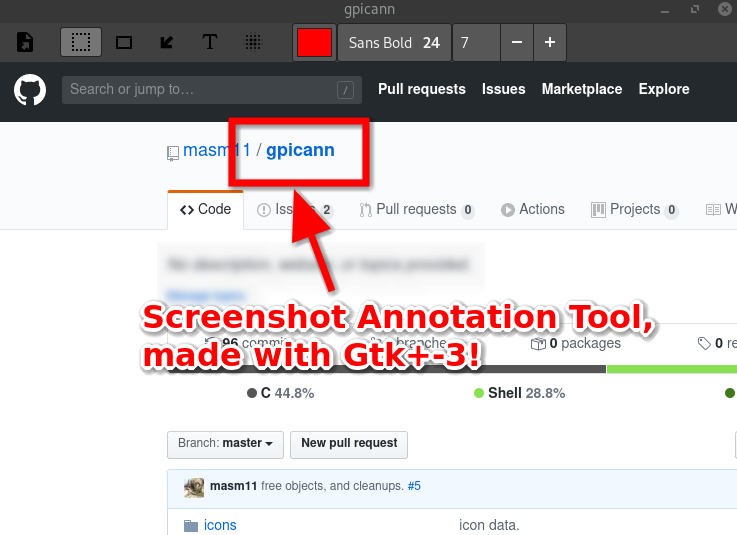

# Screenshot Annotation Tool



## Requirements

- Gtk+3
- Cairo
- Pango

## Installation

### ArchLinux

```sh
git clone https://github.com/masm11/gpicann.git
cd gpicann
./configure --prefix=/usr
make
sudo make install
```

### Debian

```sh
sudo apt-get install intltool libgtk-3-dev
git clone https://github.com/masm11/gpicann.git
cd gpicann
./configure --prefix=/usr
make
sudo make install
```

## Usage

1. take a screenshot with another tool.

2. invoke gpicann on a command line:
   ```
   gpicann screenshot.png
   ```
   or right-click on a PNG file and select gpicann on GUI.

## How to

- Modify text

  Click select item on the toolbar, and double-click your text.

- Raise

  Click select item on the toolbar, click your item, and press `ctrl+f`.

- Lower

  Click select item on the toolbar, click your item, and press `ctrl+b`.

- Undo

  Press `ctrl-z`.

- Redo

  Press `ctrl-shift-z`.

- Delete

  Click select item on the toolbar, click your item, and press `backspace`.

## License

GPLv3. See [COPYING](COPYING).

## Author

masm11
